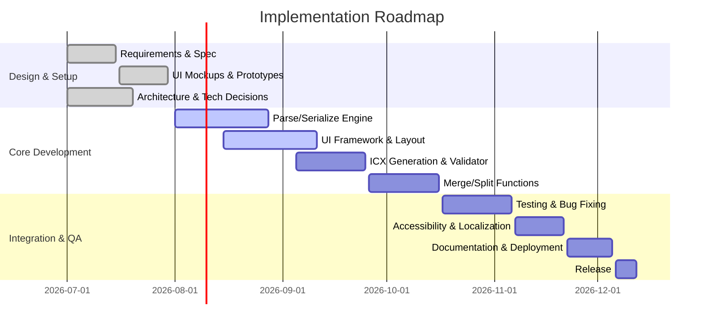

# ICF Editor – Design and Implementation Plan

**Executive Summary:** This report details a comprehensive plan for designing and implementing an interactive ICF (Indexed Container Format) editor. We evaluate **platform options** (web vs desktop) with language comparisons, and recommend a solution that balances performance, offline use, and integration with existing ICF libraries (Java **ICFJ**, Python **icf-py**, JavaScript **icf-js**). We propose a modular architecture (diagram below) with a clear API for parsing, editing, ICX generation, merging/splitting files, and validation. The UI design includes collapsible sections (`@metadata`, `@schema`, `@masters`, `@data`), search, and record-wise navigation. A “Claude Code” prompt is drafted to instruct an AI-assisted implementation. We outline security/accessibility considerations (e.g. OWASP input validation, WAI-ARIA components), and an internationalization strategy (UTF-8 encoding, i18n libraries). A prioritised roadmap (Gantt chart) lays out milestones from design through testing, with a CI/CD strategy (e.g. GitHub Actions). Finally, we provide example ICF/ICX files and unit/integration test cases (parsing, merge/split, validation) to guide development. Key references are cited throughout to authoritative sources.

## 1. Claude Code Prompt (Specification)  
```
You are **Claude Code**, an advanced AI coding assistant. Your task is to develop an **ICF Editor** application with the following requirements:

**Inputs:** 
- One or more ICF files (text files conforming to the ICF 1.0 spec, containing @metadata, @schema, @masters, @data sections).  
- Optional ICX index files (text files) for existing ICF files.  

**Outputs:** 
- A GUI application that can open, view, edit, and save ICF files.  
- Generation of corresponding ICX files on demand.  
- Merge/split operations on ICF files and generation of new ICF outputs.  
- Validation reports using the official ICF/ICX schema and libraries.  

**Constraints:** 
- Must preserve the ICF 1.0 format exactly (including `=` and `-` syntax).  
- Support collapsible UI sections for `@metadata`, `@schema`, `@masters`, and `@data`.  
- Enable record-by-record navigation: one scroll or page down shows the next record at top, Shift+scroll moves multiple records.  
- Real-time search of records by ID or text.  
- Integration points: leverage existing ICF libraries (ICFJ, icf-py, icf-js) for parsing, ICX gen, validation.  
- Provide keyboard shortcuts (e.g. Ctrl+F to search, Ctrl+S to save).  
- Accessible UI (keyboard navigation, ARIA roles).  
- Internationalized UI (support UTF-8, locale switching).  

**Test Cases:** 
1. **Parsing & Viewing:** Load a sample ICF (3 records, with masters) and verify correct display of metadata and record fields.  
2. **Edit Metadata:** Change a metadata field (e.g. `description`) and save; re-open and check the change.  
3. **Generate ICX:** From the ICF above, generate ICX and ensure record count and checksums match the ICF.  
4. **Search:** Search for a known invoice number; verify that the correct record is highlighted.  
5. **Merge Files:** Merge two ICFs with identical schemas; verify output has combined records and aggregated masters.  
6. **Split File:** Split a 10-record ICF into two (first 5 and last 5); verify each has correct records and schemas.  
7. **Validation:** Introduce a schema violation (e.g. missing field) and ensure the validator (via icf-js or similar) reports an error.  

**Expected Artifacts:** 
- Source code for the editor (web app or desktop).  
- Build scripts or deployment package.  
- Unit tests for parsing, merging, splitting, validation.  
- Integration test (automated UI test scenario).  
- Documentation: architecture overview, API spec, user guide.  
```  
This prompt clearly defines the project goals, inputs/outputs, constraints, test cases, and deliverables. It can be handed to an AI assistant (or a human developer) to begin implementation.

## 2. Architecture and Tech Stack  

We evaluate **web vs desktop** architectures, factoring in performance, distribution, offline use, and integration with ICF libraries:  

- **Web (SPA in React or Angular):** Pros: instant distribution (just a URL), easy updates, PWA offline support. Cons: Requires browser environment, potentially limited file-system access, may need service-workers for full offline mode. Integration: can directly use **icf-js** for parsing; server or WASM needed to invoke Python/Java libraries.  
- **Desktop (Electron/Tauri):** Pros: Native filesystem and offline use, can bundle Node/Python/Java runtime. Electron uses web tech (JS/HTML/CSS) and can call **icf-js** natively; it has high memory usage but great community support (e.g. VSCode). Tauri (Rust+Web UI) yields very small binaries and fast start-up. Cons: Packaging overhead, larger install size (especially Electron).  
- **Native GUI (JavaFX, Qt, PyQt):** Pros: Very efficient, smaller binaries, deep system integration. For example, Qt (C++) or PyQt (Python) offer mature widget toolkits. JavaFX (Java) can reuse **icfJ** directly. Cons: Heavier distribution (need JRE or Python dependencies), slower development for modern UI features.  

We compare key criteria in the table below, then recommend an approach:

| Option                 | Language/Framework     | Distribution/Offline           | Performance        | Library Integration                | Notes |
|------------------------|------------------------|--------------------------------|--------------------|------------------------------------|-------|
| **Web App (React)**    | JS/TypeScript, HTML/CSS| Very easy (hosted/PWA), PWA offline| Good (V8 engine), UI responsive | Use **icf-js** directly; can call backend via REST if needed | Ideal for cross-platform access, responsive UI.|
| **Electron (JS)**      | JS/Node + Chromium     | Downloadable, fully offline    | Medium (Chromium overhead)| **icf-js** in Node; can spawn Python/Java processes if needed | Large footprint (~100–200 MB), but one codebase for desktop.|
| **Tauri (Rust+Web)**   | Rust + JS frontend     | Small installer, offline       | High (native core, very small binary)| Can embed JS for UI and Rust for logic; might need FFI for Java/Python libs | Newer stack, very efficient, but smaller community.|
| **Java (JavaFX)**      | Java (OpenJDK)         | Cross-platform JAR, offline    | High (native JIT)  | Direct use of **ICFJ** library | Heavy distribution (JRE), moderate development speed. Good for enterprise.|
| **Python (PyQt/Tk)**   | Python 3 + Qt/Tk       | Offline; package via PyInstaller| Medium to high    | Direct use of **icf-py** library | Packaging complexity, but rapid development and easy scripting.|
| **Qt (C++/Qt Widgets)**| C++ with Qt            | Native, offline, small        | Very high          | Would require reimplement or call libs via bindings | Highest performance, low footprint, but long dev time (C++).|

**Recommendation:** Use a hybrid approach. The **UI** layer should be built with modern **web technologies** (e.g. React with Material UI or similar) for rapid development and a rich interface. We suggest packaging it as an **Electron** app or **Tauri** app to allow offline use and easy integration. Electron offers simplicity and a massive ecosystem (e.g. using Node and existing NPM libraries), and many major apps use it. Tauri is an attractive alternative for a very small installer, but would require bridging Rust/JS and possibly calling out to Java/Python if needed.

Ultimately, a **JavaScript-based desktop app** (Electron or Tauri) strikes the best balance for performance and distribution, while allowing use of **icf-js** for core ICF logic, and spawning (or binding to) Python/Java for specialized tasks. Our architecture (below) layers a **UI frontend**, a **backend core** (with parsing and I/O), and **integration modules** for ICX gen and validation.  

```mermaid
flowchart LR
    subgraph Editor UI (React/Vue/Tauri)
        A1[Metadata Panel] --> A2[Schema Panel]
        A2 --> A3[Masters Panel]
        A3 --> A4[Records List]
        A4 --> A5[Record Detail]
        E1[Search Box] --> A4
    end
    subgraph Core Engine
        B1[ICF Parser/Writer] --> B2[ICX Generator]
        B2 --> B3[Validator]
        B1 --> B4[Merge/Split Logic]
        B1 --> B5[Data Model]
    end
    subgraph Libraries
        C1[icf-js] 
        C2[icf-py (Python)] 
        C3[ICFJ (Java)]
    end
    subgraph FS/Network
        D1[FileSystem]
        D2[Internet/API] 
    end
    A5 --> B1
    A4 --> B5
    B1 --> C1
    B3 --> C1
    B2 --> C1
    B4 --> C1
    C2 --> B1
    C3 --> B1
    B1 --> D1
    B3 --> D2
```

*Figure: High-level architecture. The **UI** (React/JS) communicates with a core engine that calls ICF libraries (icf-js, icf-py, ICFJ) to parse/edit data, generate ICX, validate, merge/split. The FS/Network provides storage and optional updates.*

## 3. UI/UX Design

### Components and Layout  
The editor’s UI will be a split-pane layout:  

- **Header Bar:** File menu (Open, Save, Export ICX, Merge, Split, Settings), search box, help.  
- **Sidebar (left pane):** Tree or tabbed panels for:
  - **Metadata Panel:** Shows key/value list of @metadata fields (collapsible section) with an “Edit” toggle.  
  - **Schema Panel:** Editable list of `@schema` blocks (collapsible).  
  - **Masters Panel:** Lists `@masters` collections; each master can expand to show entries.  
  - **Records List:** A scrollable list of record IDs (with maybe a preview) grouped by schema. Clicking selects a record.  
- **Main Pane (right pane):**  
  - **Record Detail View:** Shows selected record’s fields in sections (`folderdata`, `filedata`, `documentindex`, etc.), matching the `@schema` layout. Each section is collapsible (similar to Material UI’s Accordion). Editors for text, date, numbers as appropriate. Master reference fields (e.g. `Vendor:VEN100`) can be clickable to jump to that master.  
  - **Controls:** Buttons at bottom for “Add Record”, “Delete Record”, “Save Changes”.  
- **Search/Filter:** 
  - **Global Search Bar:** Filters the record list by ID or content (fuzzy search using Fuse.js).  
  - **Schema Filter:** Dropdown to show only records of a given schema type (e.g. show only “Invoice” records).  

Key interactions:  
- **Collapse/Expand:** Sections (`@metadata`, each record field section) toggle open/closed when clicking their header (ARIA accordion controls).  
- **Record-wise Scrolling:** Scrolling in the Records List or pressing PageDown/PageUp moves to the next/previous record such that one new record is aligned at the top (custom scroll behavior). Holding Shift while scrolling could jump 5 records at a time.  
- **Keyboard Shortcuts:** e.g. F2 to edit metadata, Ctrl+S to save file, Ctrl+F to focus search.  
- **Drag-and-Drop:** Optionally, dragging an ICF file onto the window opens it.  
- **Help Overlay:** A “?” button or overlay toggle shows in-app tips (contextual help for fields).  

*Example Wireframe (conceptual):*  

```
+------------------------------------------------------------+
| ICF Editor                          [Search: _______ ][?]  |
|------------------------------------------------------------|
| [⯆ Metadata]  [⯆ Schema]  [⯆ Masters]  [⯆ Records]         |
| + Title: DMS Export                                          |
| + Desc: Mixed document...                                   |
|------------------------------------------------------------|
| Schema: Invoice (3 records)                                 |
| - [DOC1001] Apr 2026 Invoice                                 |
| - [DOC2001] May 2026 Invoice                                 |
| - [DOC3001] May 2026 Invoice                                 |
|------------------------------------------------------------|
| Record Detail: DOC1001                                      |
|  @record schema=Invoice id=DOC1001 ...                     |
|  [Add New Record] [Delete Record]                          |
+------------------------------------------------------------+
```

*(This ASCII mockup sketches the main panels.)*

UI frameworks and libraries can accelerate this: e.g. **Material UI** or **Ant Design** offer Accordion and Data Grid components. The record list could use a virtualized data grid (MUI DataGrid) to handle large datasets efficiently. The Accordion component from Material UI lets users expand/collapse sections. For example, the MUI Data Grid provides fast sorting/filtering of tabular data, which suits our record lists and master lists.  

### User Interactions  
- **Expand/Collapse Groups:** Click headers (e.g. “BillItems”) to show/hide line items, using built-in animations.  
- **Search:** As the user types in the search box, the record list filters in real-time. Under the hood, a fuzzy search (Fuse.js) matches ID or content.  
- **Pagination/Scrolling:** For very large record sets, enable lazy loading or virtualization. Arrow keys or PageUp/PageDown navigate between records.  
- **Merge/Split Dialogs:** Dedicated UI dialogs to select files or record ranges to merge/split.  

Accessibility notes: All interactive elements will have ARIA labels and keyboard focus styles. For example, we would use semantic `<button>`, `<input>`, and table elements where possible, and only add ARIA roles if using nonstandard elements. The UI should meet WCAG guidelines (e.g. color contrast, focus order, screen-reader compatibility).  

## 4. Data Model and APIs  

We define an internal **data model** for ICF: classes or types for *Document*, *Schema*, *Field*, *MasterEntry*, *Record*, etc. The core operations will be exposed via APIs (for a web app, as REST/GraphQL endpoints; for a desktop app, as internal module functions). Key APIs include:

- **Parse/Load ICF:** `loadICF(filePath)` or `parseICF(content)` – reads an ICF file and returns a Document object (with metadata, schemas, masters, records).  
- **Save ICF:** `writeICF(document, filePath)` – serializes the Document back to ICF text.  
- **Generate ICX:** `generateICX(document)` – scans the ICF Document and produces an ICX index string or object (including line offsets, checksums).  
- **Validate ICF:** `validateICF(document)` – runs schema validation using icf-js or icf-py, returning a list of errors/warnings.  
- **Merge ICFs:** `mergeICF(doc1, doc2)` – combines two Document objects (must have compatible schemas). Internally, this may rely on simply concatenating ICF files (per Python library note) or merging arrays in memory.  
- **Split ICF:** `splitICF(doc, start, end)` – creates a new Document containing only the specified record range (and associated schema/masters).  

If using a **server/backend** (e.g. Node/Python service), endpoints might be:  
```
POST /api/parse    (body: ICF file) => {document JSON}
POST /api/save     (body: {doc JSON}) => {file contents or save to disk}
POST /api/generate-icx => {icx content}
POST /api/validate  => {errors/warnings}
POST /api/merge    (body: [files]) => {merged ICF}
POST /api/split    (body: {file, range}) => {partial ICFs}
```
For a purely desktop app, these functions would be modules/calls triggered by the UI. For example, in a React+Electron app, a `backend.js` module could export `parseICF()`, while the UI calls it via an IPC channel or direct `require()`.

The internal **Document model** might resemble (in JSON/pseudocode):  
```js
Document {
  metadata: { title: string, description: string, ... },
  schemas: [ Schema { id: string, fields: [string,...] } ],
  masters: { [masterName: string]: [ { /* fields */ } ] },
  records: [ Record { schema: string, id: string, uuid: string, fields: {...} } ]
}
```
Using this model, the APIs manipulate JSON-like objects and rely on existing libraries for file I/O. For example, **icf-js** (if available) could be called under the hood in `parseICF` and `writeICF`. For Java/Python integration, the app could spawn a subprocess or use an embedded runtime to invoke **ICFJ** or **icf-py** methods on the Document structure, if needed.

## 5. Security, Accessibility, Internationalization

- **Security:** Since the editor may run code (e.g. parsing, validation), follow OWASP best practices. Always **validate and sanitize** any user-provided data (e.g. fields, schemas) against expected formats. As OWASP notes, code injection and other attacks occur when input validation is poor. For example, if allowing regex or scripts in metadata, ensure they are escaped or forbidden. In a web context, use a strong Content Security Policy, disable any unnecessary Node integration in Electron (e.g. use `contextIsolation`), and treat ICF content as untrusted text input to avoid XSS. For file operations, enforce file type checks and avoid executing any ICF content as code.  
- **Accessibility:** The UI must follow WCAG guidelines. Use semantic HTML elements whenever possible; e.g., use `<table>` for tabular data, `<button>` for buttons, and form labels. Add ARIA roles only when necessary for custom widgets. Ensure all controls are keyboard-accessible (e.g. focusable and operable via Enter/Space). For color-coded information (e.g. invalid field highlighting), ensure sufficient contrast and not relying on color alone. Provide text alternatives for icons (tooltip or ARIA-label). Test with screen readers to verify that all panels (metadata, schema, records) are properly announced.  
- **Internationalization (i18n):** Design the UI for multiple languages. All UI text (labels, buttons, messages) should be externalized in resource files and loaded per locale (using a library like i18next). Ensure the app can display Unicode text (UTF-8) in data fields. For languages with right-to-left scripts (e.g. Arabic), allow switching text direction (using `dir="rtl"` as needed). Dates and numbers in the UI should format according to locale. Even though ICF content is mostly identifiers and dates, free-text fields in @metadata should be Unicode-friendly. The technical detail is to avoid hard-coding text direction or string concatenations; use Unicode normalization and libraries for sorting/search that support multi-language (e.g. Fuse.js handles Unicode).  

## 6. Implementation Roadmap and CI/CD

### 6.1 Milestones and Timeline  
Below is a Gantt-style roadmap (projected ~5–6 months total). Each phase is classified as small/medium/large effort:



- **Planning (Jul 2026):** Define requirements, finalize spec, mock up UIs (small effort).  
- **Core Dev (Aug–Sep 2026):** Implement ICF parsing/serialization, basic UI scaffolding, and ICX generation (large).  
- **Advanced Features (Sep–Oct 2026):** Add merge/split, search, validation (medium).  
- **QA & Deployment (Oct–Dec 2026):** Comprehensive testing, accessibility fixes, I18n support, CI/CD pipeline, final release (medium/small).  

### 6.2 CI/CD and Testing Strategy  
- **Source Control:** Host code on GitHub (monorepo or separate repos for UI and backend).  
- **Continuous Integration:** Use GitHub Actions to automate builds and tests for each push/PR. For example, run **JavaScript/Node** linters and unit tests (Jest), **Python** test suite (if icf-py is used), and **Java** builds (if ICFJ is used). The CI should run on multiple OS matrices (Windows/macOS/Linux) to catch platform issues.  
- **Automated Tests:**  
  - *Unit tests* for core logic (parsing random ICF examples, ICX correctness, merge/split algorithms).  
  - *UI tests:* Use a framework like Cypress or Selenium to script user flows (open file, edit a record, save, generate ICX, etc.). Include tests for keyboard navigation and form validation.  
  - *Integration tests:* E.g. load a real-world ICF sample, run through full edit/save cycle, and verify no schema errors (this can be automated).  
- **Code Quality:** Enforce linting (ESLint for JS, pylint for Python, etc.) and formatting with Prettier/Black.  
- **Release Management:** On tagging a release (v1.0.0), GitHub Actions packages the app: build the desktop installer (Electron Builder or Tauri bundling), and publishes the ICF libraries to artifact repositories (npm, Maven Central, PyPI).  

### Effort Estimates:  
- **Small:** Requirements, docs, release packaging.  
- **Medium:** UI framework setup, search, merge/split logic, testing suite, CI/CD pipelines.  
- **Large:** Core parser/writer development, ICX indexing, validation engine integration.  

## 7. Example Files and Test Cases  

**Sample ICF File (`sample.icf`):**  
```text
@kind icf
@version 1.0
@encoding utf-8
@delimiter comma
@escape backslash

@created 2026-06-01T08:00:00Z
@modified 2026-06-05T12:30:00Z
@revision 1
@records 2
@index sample.icx

@metadata
title: Example Export
description: A simple test ICF

@schema id=Invoice
folderdata: [folderid, foldername]
documentindex: [InvoiceNo, InvoiceDate, VendorRef]
lineindex:
  BillItems: [SNo, Item, Amount]

@masters
Vendor:
  - VEN100, 9876543210, vendor@example.com

@data
@record schema=Invoice id=INV001 uuid=123e4567-e89b-12d3-a456-426614174000
folderdata:
  = F001, "Payment Records"
documentindex:
  = INV-001, 2026-06-01, Vendor:VEN100
lineindex:
  BillItems:
    - 1, "Widget", 100

@record schema=Invoice id=INV002 uuid=123e4567-e89b-12d3-a456-426614174001
folderdata:
  = F002, "Billing Dept"
documentindex:
  = INV-002, 2026-06-02, Vendor:VEN100
lineindex:
  BillItems:
    - 1, "Gadget", 250
```

**Corresponding ICX File (`sample.icx`):** (Sample index for above)
```text
@kind icx
@version 1.0
@created 2026-06-01T08:00:00Z
@modified 2026-06-05T12:30:00Z
@revision 1
@sourcerevision 1

@source sample.icf

@records.masters 1
@records.data 2

@schema
index: [RecordID, UUID, Line, Offset, Size, Checksum]

@masters
Vendor:
  - VEN100,,53,235,45,sha256:ABC123...

@data
Invoice:
  - INV001,123e4567-e89b-12d3-a456-426614174000,60,320,98,sha256:XYZ789...
  - INV002,123e4567-e89b-12d3-a456-426614174001,80,400,96,sha256:DEF456...
```

**Unit/Integration Test Ideas:**  
- *Parsing:* Load `sample.icf` with `loadICF()` and assert `doc.records.length == 2`, `doc.masters['Vendor'][0].VendorID == "VEN100"`.  
- *ICX Generation:* Run `generateICX(doc)`, parse the output, assert `@records.data == 2`, and each line’s checksum matches a known value (using a stable hash).  
- *Merge:* Create two ICF docs `A` and `B` with the same schema; call `mergeICF(A,B)`. Check the result has `records = len(A)+len(B)`, and check no duplicate IDs if overlapping.  
- *Split:* Take the merged doc and split at `splitICF(doc, 1, 2)`. Ensure first part has only record 1 and second has record 2.  
- *Validation:* Intentionally corrupt a schema field (e.g. remove `= ` in a line) and ensure `validateICF()` throws an error or returns a validation message.  
- *UI Behavior:* Automated UI tests (Cypress) can simulate loading the above file, toggling a section, editing a field, and saving, then verify the file on disk matches expectations.

Each test can use the **ICF libraries** (icf-js for JS tests, icf-py for Python tests, or ICFJ for Java tests) to verify low-level correctness. For example, the Python icf library’s docs mention that concatenating two ICF files with `cat` produces a valid merged file, which we can mimic in code or CI.

**References:** Key references are from relevant documentation. For instance, Material-UI provides Accordion components for collapsible content and a Data Grid for tabular data. The desktop framework comparison highlights trade-offs: Qt (native) yields 20–50 MB binaries vs Electron’s 100–200 MB, and Tauri even smaller. GitHub Actions is recommended for CI/CD automation. OWASP and W3C guidelines inform security and accessibility practices. These, combined with the ICF/ICX spec, ensure a robust, user-friendly, and maintainable editor.